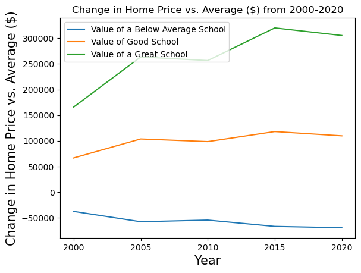
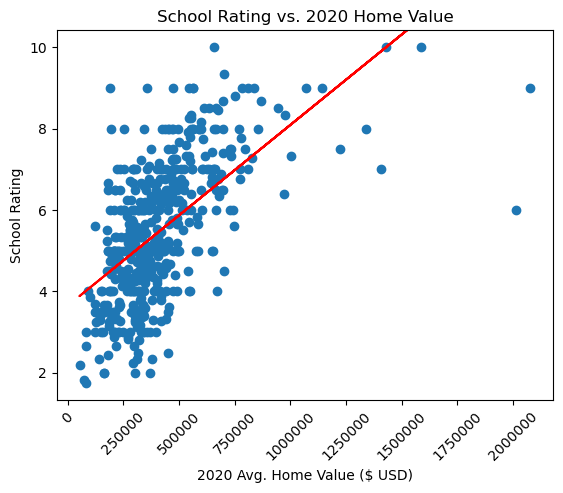
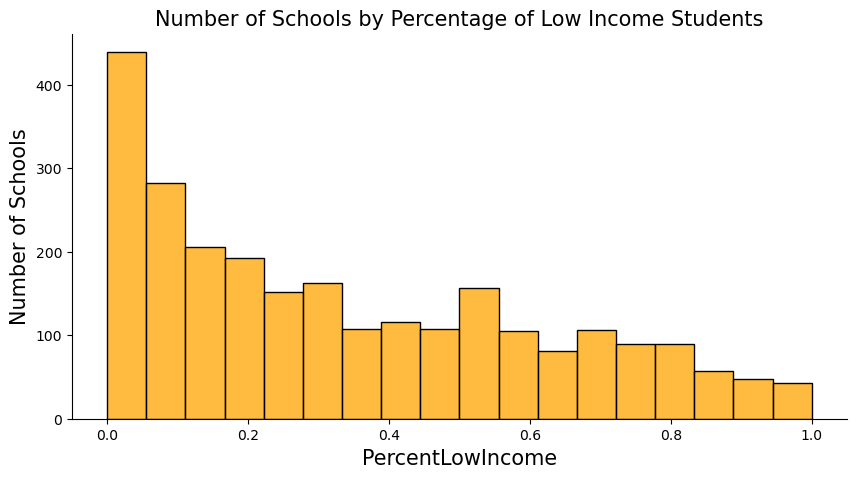

# Home Values Difference versus School Rating in New Jersey 

# Project Description/Outline: 
    #Data analysis of real estate information and school district ratings to identify trends in the market
    #Observe charted data to determine possible correlations between school ratings and home prices

# Research Questions to Answer:
#### What is the relationship between school district metrics and the real estate data such as property value?
#### Do districts with a higher proportion of families from low-income backgrounds have a different success rate? 
##### How much more are people willing to pay for a home in a better school district?

    
# Data Used and Analyzed
#### Zillow Housing Data (CSV)

#### Great Schools Neighborhood Data (Web Scraping)

        
# Conclusions
### Longitudinal

####  This graph charted the average home value for three different categories of school rating (<6, 6-8, 8+) for the last 20 years. The ANOVA test revealed an f-value of 15.532 which exceed the critical value -- this suggests that these groups are diffreent in a significant manner. When looking at the graph, it is evident that the better the school district, the higher the average school price is over the last 20 years. 

####  These values represent the dollar value that a great, good, or below average school district creates against the average home value in New Jersey. For example, the below average school district has houses that are ~$70k cheaper than the average 2020 home. 

#### Notably, these differentials are not steady even though the previous graph shows that all three categories demonstrated the same general shape. The below average school district is becoming cheaper ($37k vs $70k less). The good school district fluctuated up and down in the last 20 years but has stayed around $100k more in the last 15. The value of a great school district in 2000 was $165k but now these same districts cost in excess of $300k more than average. 

### Recent Data

####  Looking at the most recent Zillow data, a house in a poor school district averages around $365k, a good district costs about $570k, and the top tier of school districts run over $800k. 

####  When completing a scatter plot for each year and a linear regression, we see a weak correlation between home value and school rating. Each year had a R-Value around 0.33. This r-value illustrates taht there is likely other factors in play when considering home value. These variables may include related items such as crime rate, access to groceries, walkability, etc. In future analysis, we could correct for square footage and room count by zooming in on a few specific school districts.

### Low Income Households

####  Although home price is a good proxy for general wealth, we can also use the percentage of low income students in a school to investigate more directly whether the average income of a district affects its rating and thus its home values. 

#### In an exploration of the school districts in our dataset, the bar graph illustrates heavily right-tailed distribution. In other words, there are many more school districts with less low income students.

#### In our regression of percentage of low income students and school rating, there is a moderate negative correlation (r-value = 0.48). Once we cross over to districts with a percentage over 60%, none of the areas have a school rating of Good or Great (6-8, 8+). In other words, none of the highly performing school districts in New Jersey contain a majority of low income students. 

####  As we zoom out to the county level, the trends for home value and school rating hold steady. As the school ratings get better, so too do the average home values. 
